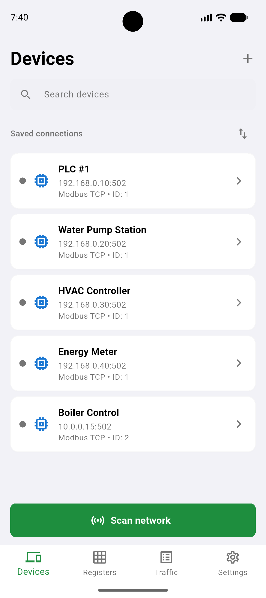
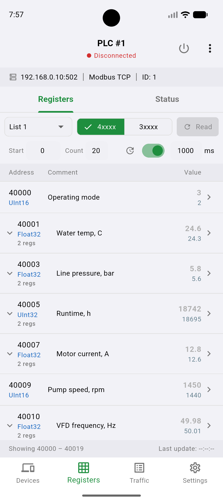
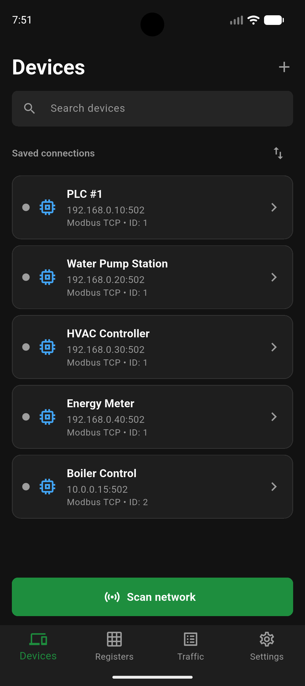

# OpenModScan Mobile

Mobile version of the OpenModScan Modbus master/client utility.

## Screenshots

   

## Features

- Save Modbus devices and register lists.
- Connect to Modbus TCP and Modbus RTU/IP devices.
- Read holding registers, input registers, coils, and discrete inputs.
- Write holding registers and coils when writes are enabled.
- Discover Modbus TCP and Modbus RTU/IP devices on the local network.
- Inspect captured Modbus traffic with decoded frame details.
- Export and import app settings and saved devices as a JSON backup.
- Support English and Russian UI localization.

## Protocol Support

| Protocol | Notes |
| --- | --- |
| Modbus TCP | Standard Modbus master/client connections over TCP. |
| Modbus RTU/IP | RTU-style Modbus frames transported over TCP/IP. |

## Getting Started

[Install Flutter](https://docs.flutter.dev/get-started/install) (Dart SDK `^3.12.0`), then fetch dependencies:

```sh
flutter pub get
```

Run the app:

```sh
flutter run
```

Build release artifacts for a target platform:

 Android APK:

```sh
flutter build apk
```

 iOS:

```sh
flutter build ios
```

> [!NOTE]
> iOS builds require Xcode and a configured Apple signing environment.

## Quality Checks

Run static analysis:

```sh
flutter analyze
```

Run tests:

```sh
flutter test
```

Run tests with coverage:

```sh
flutter test --coverage
```

The CI workflow enforces at least 80% line coverage from `coverage/lcov.info`.
Coverage output is a local artifact and is ignored by git.

Run integration tests (requires a connected device or running emulator):

macOS / Linux:

```sh
scripts/integration_test.sh
```

Windows (PowerShell):

```powershell
.\scripts\integration_test.ps1
```

Windows (cmd.exe):

```bat
scripts\integration_test.bat
```

The demo scenarios (`app_smoke_test.dart`, `register_write_test.dart`) need the
demo fixtures, so they must run with `--dart-define=OMODSCAN_DEMO_DATA=true` —
the script sets this for you. The seeded scenarios (`device_crud_test.dart`,
`settings_test.dart`) own their state and pass with or without the flag.

## Notes

- Writes can be disabled in Settings.
- Multiple-register writes fall back to sequential single-register writes when
  a device rejects function code 16 with an illegal-function exception.
- Traffic file logging writes `modbus-traffic.log` in the app documents
  directory when enabled.

## License

Released under the [MIT License](LICENSE).
